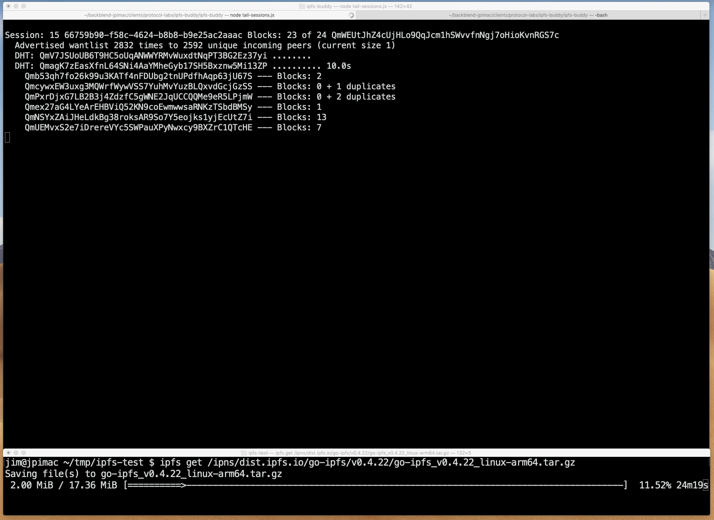

go-ipfs with extra tracing + ipfs-spy
=====================================

This is a modified version of go-ipfs that emits extra trace events and a Node.js
app to display them.



# Checkout

Branch: [github.com/jimpick/go-ipfs#jim/network-logging](https://github.com/jimpick/go-ipfs/tree/jim/network-logging)

```
git clone https://github.com/jimpick/go-ipfs.git
git checkout jim/network-logging
```

# Build this branch of go-ipfs

(emits extra tracing events)

```
make build
```

# Run

```
./cmd/ipfs/ipfs daemon
```

# Run ipfs-spy tool

Run it in another terminal

Requires Node.js (no extra dependencies)

```
node ipfs-spy.js
```

# Example commands to run and watch

* `ipfs get /ipns/protocol.ai`
* `ipfs get /ipns/ipfs.io`
* `ipfs get /ipns/docs.ipfs.io`
* `ipfs get /ipns/dist.ipfs.io/go-ipfs/v0.4.22/go-ipfs_v0.4.22_linux-arm64.tar.gz`
* `ipfs get /ipfs/QmYdGGwQXpaBGTVWXqMFVXUP2CZhtsV29jxPkRm54ArAdT` ([Filecoin Proof](https://github.com/filecoin-project/rust-fil-proofs/blob/master/filecoin-proofs/parameters.json))

Also try IPFS Companion:

* [Wikipedia - Artemis](http://127.0.0.1:8080/ipfs/QmXoypizjW3WknFiJnKLwHCnL72vedxjQkDDP1mXWo6uco/wiki/Artemis.html)
* [WebUI Peers](http://127.0.0.1:8080/ipfs/QmNyMYhwJUS1cVvaWoVBhrW8KPj1qmie7rZcWo8f1Bvkhz/#/peers)
* [awesome.ipfs.io](http://127.0.0.1:8080/ipns/awesome.ipfs.io/)

Run garbage collection periodically so you can retry downloads: `ipfs repo gc | wc -l`

